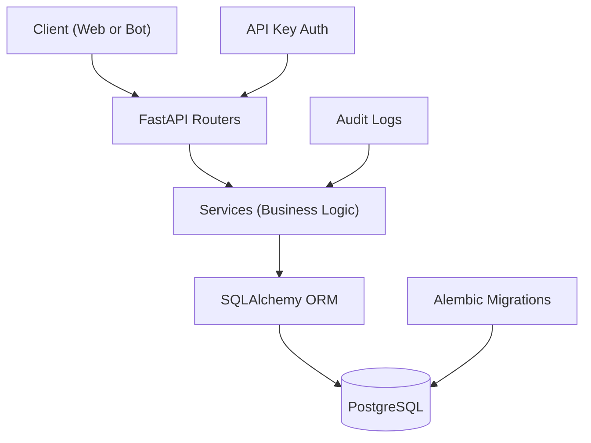

# ServiceFlow — Backend‑сервис для управления внутренними заявками

**ServiceFlow** — производственный backend‑сервис на **FastAPI**, построенный по принципам слоистой архитектуры.  
Подходит для IT‑поддержки, Helpdesk, HR‑процессов и любых внутренних тикет‑систем компании.

Проект включает ролевую модель, строгую бизнес‑логику, аудит, миграции БД и Docker‑инфраструктуру уровня продакшена.

---

##  TL;DR

**Функциональность:**
- Управление сервисными заявками  
- Роли: **ADMIN / AGENT / EMPLOYEE**  
- Статусы: **NEW → IN_PROGRESS → DONE / CANCELED**  
- Авторизация через `X-API-Key`  
- PostgreSQL + SQLAlchemy 2.0 + Alembic  
- Docker Compose + автотесты (Pytest)  
- Чистая архитектура: Routers → Services → ORM → DB  

**Быстрый запуск:**
```bash
docker compose up --build
````

API: <http://localhost:8000>\
Swagger UI: <http://localhost:8000/docs>

***

## Архитектура проекта

Поток обработки запроса:

    Client → FastAPI Routers → Services → ORM → PostgreSQL

Дополнительно:

*   API-Key авторизация
*   Аудит действий
*   Alembic-миграции
*   Инициализация seed‑данных



***

##  Функциональность

*   управление сервисными заявками и их статусами
*   строгая бизнес‑логика переходов статусов
*   ролевая модель:
    *   **ADMIN** — полный контроль системы
    *   **AGENT** — обработка и закрытие заявок
    *   **EMPLOYEE** — создание и просмотр собственных заявок
*   авторизация по `X-API-Key`
*   аудит действий пользователей
*   `UUID` / `public_id` для публичных маршрутов
*   миграции Alembic
*   запуск через Docker Compose
*   автотесты (Pytest)

***

##  Логика статусов

    NEW
      ↳ IN_PROGRESS
          ↳ DONE
          ↳ CANCELED

Невалидные переходы статусов **автоматически блокируются** сервисным слоем.

***

##  Авторизация

Каждый запрос должен содержать заголовок:

    X-API-Key: <твой_ключ>

***

##  ERD (схема базы данных)

Основные сущности:

*   `users`
*   `requests`
*   `audit_logs`
*   `roles`

Связи:

*   users (1) → (N) requests
*   users (1) → (N) audit\_logs

Особенности:

*   UUID как primary key
*   public\_id как внешний идентификатор

***

##  Технологический стек

*   Python 3
*   FastAPI
*   SQLAlchemy 2.0
*   PostgreSQL
*   Alembic
*   Docker / Docker Compose
*   Pytest

***

## 🗂 Структура проекта

    app/
      core/         # конфигурация, безопасность, зависимости
      routers/      # HTTP-эндпоинты API
      schemas/      # Pydantic-схемы
      models/       # ORM-модели
      services/     # бизнес-логика

    alembic/        # миграции базы данных
    tests/          # автоматические тесты

***

##  Установка и запуск через Docker

### Требования

*   Docker
*   Docker Compose

### 1. Клонировать репозиторий

```bash
git clone https://github.com/RiobVO/ServiceFlow.git
cd ServiceFlow
```

### 2. Создать файл окружения

```bash
cp .env.example .env
```

### 3. Запустить сервис

```bash
docker compose up --build
```

### 4. Применить миграции

```bash
docker compose exec backend alembic upgrade head
```

После запуска:

*   API: <http://localhost:8000>
*   Swagger UI: <http://localhost:8000/docs>

***

##  Переменные окружения

Основные переменные:

*   `DATABASE_URL_POSTGRES`
*   `API_KEY`
*   `ADMIN_BOOTSTRAP_KEY`

Примеры — в `.env.example`.

***

##  Пример: изменение статуса заявки

    PATCH /requests/{id}/status
    X-API-Key: AGENT_API_KEY

Body:

```json
{
  "status": "IN_PROGRESS"
}
```

***

##  Тестирование

```bash
docker compose exec backend pytest
```

***

## План развития

*   централизованный обработчик ошибок
*   healthcheck сервиса
*   хэширование и управление API‑ключами
*   расширенный аудит
*   ERD и диаграммы бизнес‑процессов
*   web‑админка или интеграция с Telegram‑ботом


***

## Frontend (React + Vite)

Добавлен фронтенд на **React + TypeScript + Vite** с маршрутизацией через **React Router** и связкой через REST API.

### Быстрый запуск фронтенда

```bash
cd frontend
cp .env.example .env
npm install
npm run dev
```

По умолчанию фронтенд ожидает backend на <http://localhost:8000> и работает на <http://localhost:5173>.

### Структура frontend

```
frontend/
  src/
    components/   # layout-компоненты
    pages/        # страницы и маршруты
    services/     # API-клиент
    utils/        # хуки и утилиты
    styles/       # глобальные стили
```

### Пример REST-запроса

```bash
curl -H "X-API-Key: <API_KEY>" http://localhost:8000/requests
```

### Пример использования API во фронтенде

```ts
import { api } from "./services/api";

const data = await api.listRequests(apiKey, "?limit=5");
```
