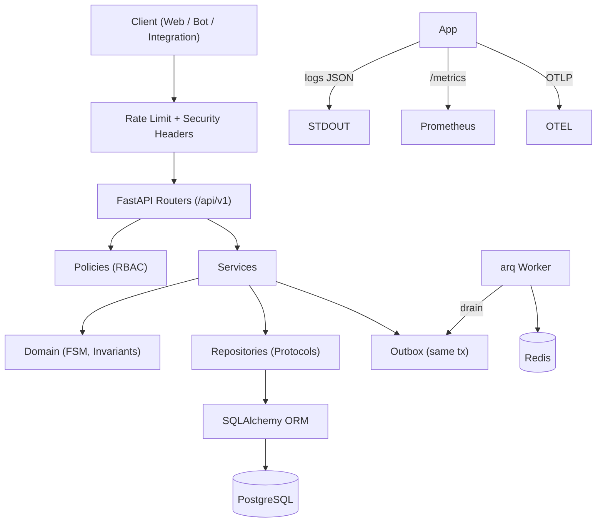
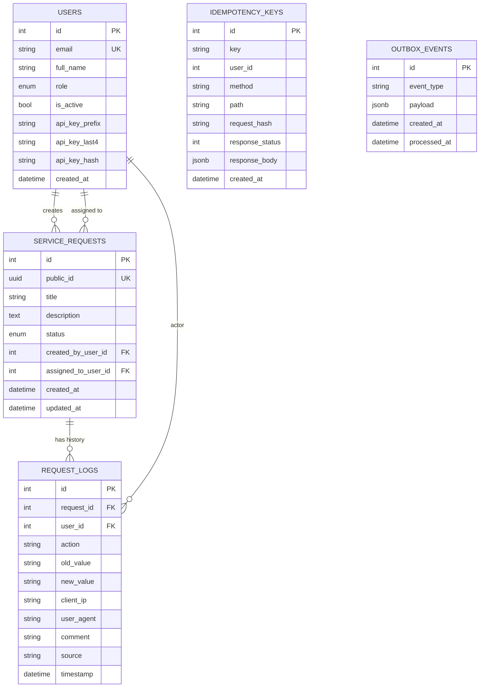

# ServiceFlow

Production-grade backend для внутренних сервисных заявок (helpdesk / IT-support / HR).
FastAPI + PostgreSQL + SQLAlchemy 2.0 + Alembic + React (Vite), с фокусом на зрелую архитектуру:
слои, Repository + Unit of Work, доменный FSM, Problem Details, argon2-хеш API-ключей,
идемпотентность, outbox-pattern, structlog, Prometheus + OpenTelemetry.

---

## TL;DR

```bash
cp .env.example .env   # задай ADMIN_BOOTSTRAP_KEY
docker compose up -d --build
docker compose exec backend alembic upgrade head
docker compose exec backend python seed.py   # создаст admin/agent/employee, выведет сырые API-ключи
```

- API: <http://localhost:8000>
- Swagger UI (только dev/staging): <http://localhost:8000/docs>
- Prometheus metrics: <http://localhost:8000/metrics>
- pgAdmin (профиль `dev`): <http://localhost:5050>

---

## Архитектура


```mermaid
flowchart TB
    Client["Client (Web / Bot / Integration)"] --> RL["Rate Limit + Security Headers"]
    RL --> Routers["FastAPI Routers (/api/v1)"]
    Routers --> Policies["Policies (RBAC)"]
    Routers --> Services["Services"]
    Services --> Domain["Domain (FSM, Invariants)"]
    Services --> Repos["Repositories (Protocols)"]
    Repos --> ORM["SQLAlchemy ORM"]
    ORM --> DB[(PostgreSQL)]
    Services --> Outbox["Outbox (same tx)"]
    Worker["arq Worker"] -->|drain| Outbox
    Worker --> Redis[(Redis)]
    App["App"] -->|logs JSON| STDOUT
    App -->|/metrics| Prometheus
    App -->|OTLP| OTEL
```

Поток запроса: `Client → Middlewares (request_id, security, cors, rate limit) → Router → Policy → Service → Domain + Repository (через UoW) → DB`. Аудит и outbox-события пишутся в **той же транзакции**, что и бизнес-изменение.

### Основные решения
- **RFC 7807 Problem Details** (`application/problem+json`) — единый формат ошибок с `code`, `request_id`, `errors[]`.
- **Doman exceptions**: сервисы кидают только `DomainError`-потомков, маппинг в HTTP — в одном месте (`app/core/errors.py`).
- **Repository + Unit of Work**: сервисы работают с интерфейсами, коммит один на бизнес-операцию.
- **Фините-автомат статусов** в `app/domain/request_state_machine.py` — без I/O, покрыт юнит-тестами.
- **argon2id-хеширование API-ключей**: prefix для индексации, `last4` для UI, сырой ключ отдаётся один раз. Есть ротация (`POST /api/v1/users/me/api-key/rotate`).
- **ETag + If-Match** на `PATCH /requests/{id}/status` — optimistic concurrency control.
- **Idempotency-Key** на `POST /api/v1/requests` — безопасный retry.
- **Outbox pattern** + `arq`-воркер — надёжные фоновые события.
- **/health/live + /health/ready** — k8s-style probes.
- **Prometheus + OpenTelemetry** — метрики RPS/latency, бизнес-счётчики, трейсинг HTTP+SQL.

---

## ERD


```mermaid
erDiagram
    USERS ||--o{ SERVICE_REQUESTS : "creates"
    USERS ||--o{ SERVICE_REQUESTS : "assigned to"
    SERVICE_REQUESTS ||--o{ REQUEST_LOGS : "has history"
    USERS ||--o{ REQUEST_LOGS : "actor"

    USERS {
        int id PK
        string email UK
        string full_name
        enum role
        bool is_active
        string api_key_prefix
        string api_key_last4
        string api_key_hash
        datetime created_at
    }
    SERVICE_REQUESTS {
        int id PK
        uuid public_id UK
        string title
        text description
        enum status
        int created_by_user_id FK
        int assigned_to_user_id FK
        datetime created_at
        datetime updated_at
    }
    REQUEST_LOGS {
        int id PK
        int request_id FK
        int user_id FK
        string action
        string old_value
        string new_value
        string client_ip
        string user_agent
        string comment
        string source
        datetime timestamp
    }
    IDEMPOTENCY_KEYS {
        int id PK
        string key
        int user_id
        string method
        string path
        string request_hash
        int response_status
        jsonb response_body
        datetime created_at
    }
    OUTBOX_EVENTS {
        int id PK
        string event_type
        jsonb payload
        datetime created_at
        datetime processed_at
    }
```

---

## Статусная модель

```
NEW ──► IN_PROGRESS ──► DONE
 │
 └────────────────────► CANCELED
```

Инварианты (см. `app/domain/request_state_machine.py`):
- Нельзя ставить тот же статус.
- Из DONE/CANCELED — никуда.
- В IN_PROGRESS — только если есть исполнитель.
- Разрешены только переходы `NEW → {IN_PROGRESS, CANCELED}`, `IN_PROGRESS → DONE`.

---

## Аутентификация

```
X-API-Key: <сырой ключ>
```

Ключ хранится в виде `argon2id`-хеша + prefix (для индексированной выборки) + last4 (для UI).
Ротация через `POST /api/v1/users/me/api-key/rotate` (rate limit 3/hour).
Bootstrap первого админа — отдельно через `X-Bootstrap-Key`.

---

## Структура репозитория

```
app/
  core/           # конфигурация, безопасность, логирование, метрики, трейсинг, rate limit, errors, idempotency
  domain/         # чистая доменная логика (FSM), без I/O
  models/         # SQLAlchemy-модели
  repositories/   # Protocol-интерфейсы + SQLAlchemy-реализации
  services/       # сервисный слой — бизнес-операции через UoW
  policies/       # RBAC-политики
  routers/        # HTTP-эндпоинты (/api/v1)
  schemas/        # Pydantic-схемы (DTO)
  workers/        # arq-воркеры
  uow.py          # Unit of Work

alembic/          # миграции
tests/
  unit/           # быстрые юнит-тесты (без БД)
  integration/    # тесты с реальным Postgres (testcontainers)
  contract/       # schemathesis против OpenAPI
```

---

## Окружение

Все переменные — в [`.env.example`](./.env.example). Значения секретов обёрнуты в `SecretStr`,
валидация при старте (длина `ADMIN_BOOTSTRAP_KEY`, формат DSN, в prod запрещён `CORS_ORIGINS=*`).

---

## Observability

- JSON-логи в stdout (structlog), сквозной `X-Request-ID` в headers и body ошибок.
- `/metrics` — стандартные HTTP-метрики + бизнес (`requests_created_total`, `requests_status_changed_total{from,to}`, `api_key_auth_total{result}`).
- OTel: включается, если задан `OTEL_EXPORTER_OTLP_ENDPOINT`. Инструментируется FastAPI + SQLAlchemy.

---

## Запуск тестов

```bash
pytest -m unit                  # быстрые
pytest -m integration           # testcontainers поднимет postgres
pytest -m contract              # schemathesis
pytest --cov=app                # с покрытием (fail_under=85)
```

---

## CI/CD

GitHub Actions: [.github/workflows/ci.yml](.github/workflows/ci.yml)
- Quality: `ruff check`, `ruff format --check`, `mypy --strict`.
- Tests: unit + integration против живого Postgres-сервиса, coverage ≥ 85%.
- Docker: сборка + `trivy` scan (HIGH/CRITICAL fail).

---

## Документация

- [docs/adr/](docs/adr) — Architecture Decision Records.
- [docs/api.md](docs/api.md) — примеры curl для ключевых сценариев.
- [SECURITY.md](SECURITY.md) — threat model и политика раскрытия.
- [CHANGELOG.md](CHANGELOG.md) — история изменений (Keep a Changelog).
- [CONTRIBUTING.md](CONTRIBUTING.md) — процесс вклада.
